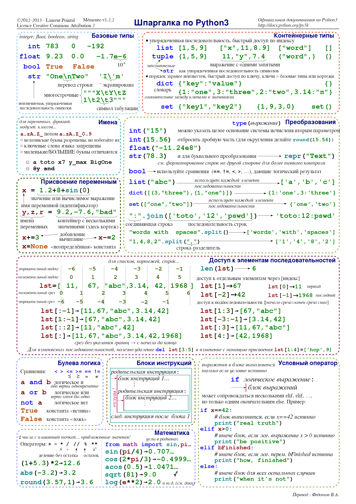
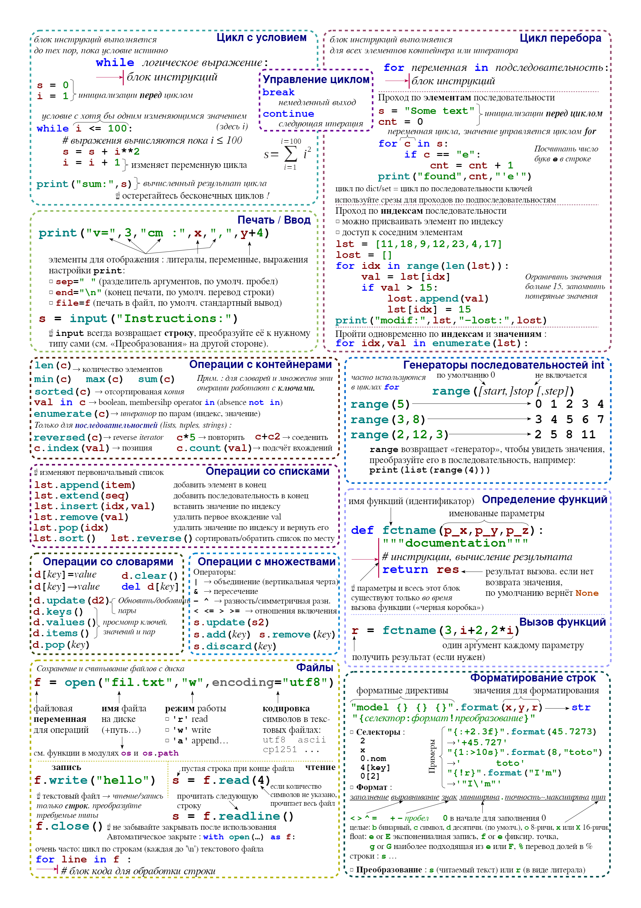
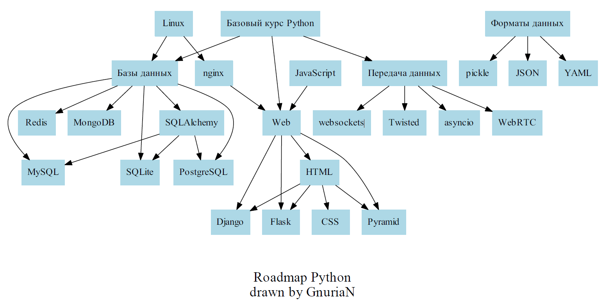

# Python Roadmap

Я решил сделать что-то вроде дорожной карты (Roadmap) для изучения языка Python. Возможно, если найдутся желающие дополнять ее, модифицировать и редактировать, то получится хорошая инструкция. Данная информация полезна тем, кто хочет изучить основы Python.

_P.S. за ссылки на курсы, видео и статьи я не получаю ничего. Все ссылки не реферальные._

---

### Благодарности:

[@IgorBeschastnov](https://github.com/IgorBeschastnov) - за правки орфографии и пунктуации  
[@GraceAredel](https://github.com/GraceAredel) - за правки орфографии и пунктуации

Если у вас есть интересная информация о курсах и направлениях развития в области использования Python, пожалуйста, не стесняйтесь и добавляйте материалы в PR. Спасибо.

---

Почему Я решил это сделать?

У меня было много попыток стать разработчиком. История об этом тут: (https://github.com/GnuriaN/Python-Roadmap/blob/master/previous_version/README.md). В итоге я устроился на работу и получил должность Junior Software Developer (2018 год).
Но я решил, что нужно продолжать создавать RoadMap и довести его до логического конца. Мой путь не единственно верный, но он мой.

---

## Содержание

1. [Мои репозитории по обучению](#мои-репозитории-по-обучению)
2. [С чего начать](#с-чего-начать)
   1. [Установка Python](#необходимо-установить-себе-python)
   2. [Рабочее окружение](#сделать-рабочее-окружение)
3. [Теперь пора учиться](#теперь-пора-учиться)
   1. [Junior](#junior)
   2. [Полезные ресурсы](#полезные-ресурсы-по-python)
   3. [Обучение профессии](#обучение-професии)
   4. [Что дальше?](#что-дальше)
4. [Дополнительные материалы](#дополнительные-обучающие-материалы)

---

## Мои репозитории по обучению

Все свои материалы по обучению из различных репозиториев я решил скомпоновать в один и поместить как подпапки в Python Roadmap. (_жалко, но он очень редко обновляется_)  
[Collection of training lectures](./сollection_of_training_lectures/README.MD)

---

## С чего начать

### Необходимо установить себе Python

1. Для этого нужно скачать его с сайта [python.org](https://www.python.org/downloads/).
2. Вам нужна [IDE](https://ru.wikipedia.org/wiki/Интегрированная_среда_разработки) для работы. [Список](https://ru.wikipedia.org/wiki/Сравнение_интегрированных_сред_разработки#Python) основных IDE можно увидеть на [Wiki](https://ru.wikipedia.org/wiki/Сравнение_интегрированных_сред_разработки#Python). Так же можно воспользоваться "продвинутыми" текстовыми редакторами. Мой список:
   1. [PyCharm](https://ru.wikipedia.org/wiki/PyCharm). Скачать можно с сайта [JetBrains](https://www.jetbrains.com/pycharm/). Можно установить обе версии `Professional` и `Community`. Позже я скажу как можно получить/получать лицензию на три месяца.
   2. [Visual Studio Code](https://ru.wikipedia.org/wiki/Visual_Studio_Code). Скачать можно с официального сайта: [code.visualstudio.com](https://code.visualstudio.com).
   3. [VSCodium](https://github.com/VSCodium/vscodium). Сборка Visual Studio Code без телеметрии от Microsoft. Других отличий нет.
   4. [Sublime Text 3](https://ru.wikipedia.org/wiki/Sublime_Text). Скачать можно с официального сайта: [sublimetext.com](https://www.sublimetext.com).
   5. [Anaconda](https://www.anaconda.com/what-is-anaconda/). Скачать можно с официального сайта: [anaconda.com](https://www.anaconda.com/download/).
      - Немного о составе дистрибутива: [anaconda.md](anaconda.md)

**Мои рекомендации:**

1. Всех лучше для изучения подходят дистрибутивы [PyCharm](https://ru.wikipedia.org/wiki/PyCharm) и [Anaconda](https://www.anaconda.com/what-is-anaconda/).
2. Для удобства можно устанавливать две версии PyCharm, `Professional` и `Community`.

### Сделать рабочее окружение

1. Для создания рабочего окружения лучше всего подходит `Python Virtual Environments`. Прочитать можно в официальном [PEP 405](https://www.python.org/dev/peps/pep-0405/). Документацию можно прочитать на официальном сайте [docs.python.org](https://docs.python.org/3/library/venv.html). Хорошая статья на [python-script.com](https://python-scripts.com/virtualenv). Существуют модули, библиотеки, которые дополняют venv, но это уже сами.

   - **Дополнительно**: советую обратить внимание на проект [PyEnv](https://github.com/pyenv/pyenv)

2. Научиться делать рабочее окружение в выбранных IDE.

Виртуальное окружение очень хорошо помогает в процессе обучения. Вы можете столкнуться с тем, что вам захочется поэкспериментировать с библиотеками или модулями, и, чтобы не засорять `рабочее` окружение, вы будете под каждую задачу создавать отдельный проект со своими модулями.

3. Я очень советую научиться использовать консоль.
   - для Windows:
     - список команд Windows ( Windows CMD ) с описанием и примерами: https://ab57.ru/cmdlist.html
     - настройка командной строки Windows: https://ab57.ru/cmdtweak.html
     - Работа с командной строкой ( CMD ) Windows: https://ab57.ru/cmdtricks.html (тут есть HotKey)
     - командные файлы Windows: https://ab57.ru/cmd.html
   - для GNU\Linux:
     - Курс "Введение в Linux". В рамках представленного курса слушатели познакомятся с операционной системой Linux и её базовыми возможностями. [https://stepik.org/course/73](https://stepik.org/course/73/)
     - TBD ...

### Важно! Нет, не так, очень ВАЖНО!

#### Flake8 - установите его и настройте.

[Flake8](https://flake8.pycqa.org/en/latest/) — инструмент, позволяющий просканировать код проекта и обнаружить в нем стилистические ошибки и нарушения различных конвенций кода на [Python](https://www.python.org/). [Flake8](https://flake8.pycqa.org/en/latest/) умеет работать не только с [PEP 8](https://www.python.org/dev/peps/pep-0008/), но и с другими правилами, к тому же поддерживает кастомные плагины.

1. Для начало посмотрите видео от [Хитрый питон](https://www.youtube.com/channel/UC2-j4-hV33hboyK1FtukJ9w) [Настраиваем flake8, чтобы улучшить качество кода](https://youtu.be/cdHnEN0Dsm0)
2. Потом почитайте:
   1. [PEP 8](https://www.python.org/dev/peps/pep-0008/)
      *  
   2. [Google Code Style Python](https://google.github.io/styleguide/pyguide.html)
   3. Советы Google по кодированию на языке Python.
      * [Часть первая: советы по программированию](https://habr.com/ru/post/179271/)
      * [Часть вторая: советы по форматированию исходного кода](https://habr.com/ru/post/180509/)
      * [Форматирование Python-кода](https://habr.com/ru/post/251531/) 
   4. [PyCharm + flake8 = ❤](https://melevir.medium.com/pycharm-loves-flake-671c7fac4f52) от Ilya Lebedev.
   5. [The Best flake8 Extensions for your Python Project](https://julien.danjou.info/the-best-flake8-extensions/)
   6. Загляните в репозиторий [awesome-flake8-extensions](https://github.com/DmytroLitvinov/awesome-flake8-extensions)
   7. И обратите внимание на комментарий от Ilya Lebedev:
   > We use all of them in `wemake-python-styleguide` ... which is `flake8` extension too. Here you can find the full list of violations produced by these plugins: [wemake-python-stylegui](https://wemake-python-stylegui.de/en/latest/)

В общем начните использовать Линтеры с самого начала обучения! Это реально очень важно для вас и для команды, в которой вы в дальнейшем будете работать.

## Теперь пора учиться

_С чего начать учиться?_ Я считаю, что самый простой способ это использовать онлайн курсы. Начинать нужно с простых, а дальше переходить к более сложным.

Начинаем с самого простого.

Возьмем большую шпаргалку по Python 3, распечатаем ее, и повесим или положим на самом видном месте.
 

Ссылка на файл: [mementopython3-russian.pdf](mementopython3-russian.pdf)
P.S. _Она висит у меня на рабочем месте до сих пор._

А еще есть очень замечательный проект [python-cheatsheet](https://github.com/gto76/python-cheatsheet), просто кладезь полезной информации. Крайне рекомендую добавить в закладки.

А еще был подкаст "[Python Junior](https://podcast.python.ru)" от [MoscowPython](https://www.facebook.com/groups/MoscowDjango/) и [LearnPython](https://learn.python.ru), его нужно слушать или смотреть. Сейчас это просто подкаст про Python, но смотреть/слушать его нужно.

Также могу порекомендовать присоединиться к Python коммьюнити в вашем городе и к разным информационным каналам.

**Telegram:**

1. [https://t.me/ru_python](https://t.me/ru_python) - Уютный чат для профессионалов, занимающихся поиском питоньих мудростей.
2. [https://t.me/ru_python_beginners](https://t.me/ru_python_beginners) - Вопросы про Python для чайников. Cпам и троллинг неприемлем. Не злоупотребляйте стикерами.
3. Если вы из `Нижнего Новгорода`, то вы всегда можете постучаться в [RANNTS](https://rannts.ru) и чатик [https://t.me/rannts](https://t.me/rannts) - это Python Community of Nizhny Novgorod!

### Junior

#### 1. Программирование на Python

**О КУРСЕ:** Курс посвящен базовым понятиям и элементам языка программирования Python (операторы, числовые и строковые переменные, списки, условия и циклы). Курс является вводным и наиболее подойдет слушателям, не имеющим опыта написания программ ни на одном из языков программирования.

**Cсылка:** [https://stepik.org/course/67/](https://stepik.org/course/67/)

**Рекомендация:** Выполняя задания и решая задачи вы можете получить лицензию от [JetBrains](https://www.jetbrains.com) на три месяца.

Затем продолжим закреплять пройденный материал с помощью следующего курса.

#### 2. Алгоритмы: теория и практика. Методы

**О КУРСЕ:** В курсе будут подробно разобраны базовые алгоритмические методы: жадные алгоритмы, метод «разделяй и властвуй», динамическое программирование. Для всех алгоритмов будут математически строго доказаны корректность и оценки на время работы. Помимо теоретических основ будут рассказаны тонкости реализации алгоритмов на языках программирования C++, Java и Python.

**Cсылка:** [https://stepik.org/course/217](https://stepik.org/course/217)

#### 3. Основы Git

**О КУРСЕ:** Система контроля версий Git является стандартом де-факто в деле управления исходным кодом и каждый разработчик должен понимать основы работы с ней. Задачей курса является описание наиболее важных команд и сценариев их использования.

**Cсылка:** [https://stepik.org/course/3145/](https://stepik.org/course/3145/)  
Очень рекомендую книгу: [ProGit](https://git-scm.com/book/ru/v2) (_там же можно найти и версию на других языках_)   
Небольшая шпаргалка по командам из одного платного курса: https://github.com/GnuriaN/UDEMY_GIT

#### 4. Python: основы и применение

**О КУРСЕ:** Курс посвящен базовым принципам языка Python и программирования в целом. Он хорошо подойдет тем, кто уже может писать простейшие программы на Python или тем, кто до этого программировал на других языках.

**Cсылка:** [https://stepik.org/course/512/](https://stepik.org/course/512/)

**Рекомендация:** Выполняя задания и решая задачи вы можете получить лицензию от JetBrains на три месяца.

После этого можно проверить, что осталось у нас в голове. Заодно что-то освежить и немного попрактиковаться. Но перед этим уже пора познакомиться с системой контроля версий GIT.

#### 5. Интерактивный учебник языка Питон

**О Курсе:** Учитесь, решая серьёзные задачи прямо в браузере. Основные плюсы:

- Удобный визуализатор
- Не нужно ничего устанавливать на компьютер: пишите и исполняйте код прямо в браузере
- Отлаживайте код по шагам и смотрите за значениями переменных
- Проверяйте правильность решения на разных входных и выходных данных
- Визуализатор переводит и объясняет ошибки в программах
- После решения задачи ознакомьтесь с образцовым решением

**Cсылка:** [http://pythontutor.ru/](http://pythontutor.ru/)

После этого стоит пройти еще один курс

#### 6. Погружение в Python

**О Курсе:** В ходе курса вы изучите конструкции языка, типы и структуры данных, функции, научитесь применять объектно-ориентированное и функциональное программирование, узнаете про особенности реализации Python, научитесь писать асинхронный и многопоточный код. Помимо теории вас ждут практические задания, которые помогут проверить полученные знания и отточить навыки программирования на Python. После успешного окончания курса вы сможете использовать полученный опыт для разработки проектов различной сложности.

**Ссылка:** [https://www.coursera.org/learn/diving-in-python](https://www.coursera.org/learn/diving-in-python)

**Зачем?** Тут даётся то, что вы еще не проходили и повторение того, что вы уже проходили. К тому же, этот курс — это начало большой программы по специализации. Но перед этим нужно познакомиться с `Базами данных`.

#### 7. Алгоритмы: теория и практика. Структуры данных

**О Курсе:** Основная цель курса — узнать, как устроены основные структуры данных (чтобы не пользоваться их готовыми реализациями как чёрным ящиком, а точно знать, чего от реализации ожидать), и научиться выбирать подходящую структуру данных при решении заданной вычислительной задачи.

Данный курс является продолжением курса «Алгоритмы: теория и практика. Методы». Если вы не проходили этот курс, мы настоятельно рекомендуем вам пройти хотя бы его первую неделю.

**Ссылка:** [https://stepik.org/course/1547](https://stepik.org/course/1547)

#### 8. Введение в базы данных

**О Курсе:** Курс введения в базы данных знакомит слушателями с историей создания систем обработки структурированных данных, подходами к обработке информации, развитием моделей данных и систем управления данными. Основу курса составляет изучение и применение в типовых ситуациях средств SQL для обработки данных в SQL-СУБД. Выполнение практических задач в рамках курса предполагает использование СУБД MySQL.

**Ссылка:** [https://stepik.org/course/551](https://stepik.org/course/551)

#### 9. Базы данных

**О Курсе:** Основу курса составляют изучение и применение языка SQL для создания, модификации объектов баз данных и управления данными в произвольной реляционной базе данных. Выполнение практических задач в рамках курса предполагает использование СУБД My SQL. В курсе рассматриваются этапы проектирования реляционных баз данных, правила составления запросов, основные методы индексирования данных. В курсе будут изучены вопросы использования транзакций и прав доступа к данным. Также курс дает обзор современных тенденций в области науки о данных в связи с появлением BigData. В заключении курса будут показаны сферы применения NoSQL баз данных и указаны современные подходы к обработке big data.

**Ссылка:** [https://stepik.org/course/2614](https://stepik.org/course/2614)

#### 10. Тестирование ПО: Базовый уровень

_Бонус для автотестеров_

**О Курсе:** Данный курс основан на официальной программе обучения "Сертифицированный тестировщик ПО Базового уровня" ISTQB и предназначен для подготовки к сдаче сертификационных экзаменов.  
Все тестовые задания, представленные в курсе, взяты из реальных экзаменов ISTQB Foundation Level..

**Ссылка:** [https://stepik.org/course/16478](https://stepik.org/course/16478)

#### 11. Автоматизация тестирования с помощью Selenium и Python

_Бонус для автотестеров_

**О Курсе:** Это базовый курс для начинающих тестировщиков, который научит вас писать автоматизированные UI-тесты на языке программирования Python с помощью библиотеки [Selenium](https://ru.wikipedia.org/wiki/Selenium). А еще мы рассмотрим популярные фреймворки и хорошие практики написания автотестов.

**Ссылка:** [https://stepik.org/course/575](https://stepik.org/course/575)

---

### Вот на этом этапе я могу порекомендовать читать интересные ресурсы, смотреть видео и практиковаться.

#### Полезные ресурсы по Python

**Ссылка:** [https://refactoring.guru/ru/design-patterns/python](https://refactoring.guru/ru/design-patterns/python)

**Рекомендация:** Очень полезный ресурс, который раскажет о "Паттернах проектирования" на Python с примерами.

---

#### Как научиться разработке на Python: новый видеокурс Яндекса

Для изучения курса нужно знать основы Python и понимать, как приложения развёртываются на серверах. Мы ждём, что вы умеете делать запросы к базам данных и знаете, как создаются веб‑приложения, — хотя бы на начальном уровне.

**Ссылка:** [https://habr.com/ru/company/yandex/blog/498856/](https://habr.com/ru/company/yandex/blog/498856/)

**Рекомендация:** Обратите внимание на дополнительные ссылки к видео.

#### Программирование на Python от CSC

**Ссылка:** [https://compscicenter.ru/courses/python/2015-autumn/classes/](https://compscicenter.ru/courses/python/2015-autumn/classes/)

**Рекомендация:** Смотреть все. От начала до конца. Можно и нужно [конспектировать](https://github.com/GnuriaN/pythoncsc) то, что вы видите. Это будет очень полезно. В этом видео вы увидите то, что уже проходили, но там вам покажут некоторые нюансы того, как это происходит.

**Комментарии:** В настоящий момент (осень 2018 г.) на CSC идет новый курс лекций [https://compscicenter.ru/courses/python/2018-autumn/classes/](https://compscicenter.ru/courses/python/2018-autumn/classes/) но .... (_дополнения в 2019 году_) смотрите курс 2015 =)

#### Курс информатики на Python 3 от МФТИ

**Ссылка:** [http://judge.mipt.ru/mipt_cs_on_python3/](http://judge.mipt.ru/mipt_cs_on_python3/)

**Рекомендация:** Смотреть на быстром просмотре. Отмечать интересные моменты и прорабатывать их.

#### Язык программирования Python от UNEEX

**Ссылка:** [https://uneex.ru/LecturesCMC/PythonIntro2014](https://uneex.ru/LecturesCMC/PythonIntro2014)
**Ссылка:** [https://uneex.ru/LecturesCMC/PythonIntro2017](https://uneex.ru/LecturesCMC/PythonIntro2017)

**Рекомендации:** Смотреть на быстром просмотре. Отмечать интересные моменты и прорабатывать их.

#### Видео с meetup'ов

##### python-videos-ru-2018

**Ссылка:** [https://github.com/hH39797J/python-videos-ru-2018](https://github.com/hH39797J/python-videos-ru-2018)

##### Видео от Geekbrains

**Ссылка:** [geekbrains_events.md](https://github.com/GnuriaN/Python-Roadmap/blob/master/geekbrains_events.md)

##### Видео от OTUS

**Ссылка:** [Открытые уроки по Python](https://www.youtube.com/watch?v=I09iX8aoCsw&list=PLfnFOImnyWRUe1cr2Qmhk6AWcfuNYv2cz)

---

Дальше мы поговорим о специализациях (большие курсы по обучению). Эти курсы уже платные, и идти на них или нет - решать вам. В интернете очень много споров о том, нужны или не нужны курсы, ходить на них или нет. Мнений много. \*_Мое мнение:_ На курсы нужно ходить, когда у тебя уже есть определенный багаж знаний и возможность его использовать. Что дадут вам курсы:

1. Помогут разложить информацию по полочкам.
2. Дадут возможность познакомиться с людьми которые, так же как и вы, изучают Python.
3. Развивать Soft Skills.

### Обучение професии

#### 1. Geekbrains.ru

На [Geekbrains.ru](https://geekbrains.ru/) сейчас (осень 2018 г.) есть два курса:

##### GeekUniversity

**Ссылка:** [https://geekbrains.ru/geek_university/python](https://geekbrains.ru/geek_university/python)

##### Программист Python

**Ссылка:** [https://geekbrains.ru/professions/python_developer](https://geekbrains.ru/professions/python_developer)

Стоимость постоянно меняется. Бывают скидки.

#### 2. LearnPython от MoscowPython

**Ссылка:** [https://learn.python.ru](https://learn.python.ru)

#### 3. Специализация Программирование на Python от Coursera

**Ссылка:** [https://www.coursera.org/specializations/programming-in-python](https://www.coursera.org/specializations/programming-in-python)

#### 4. OTUS

Тут уже для продвинутых Junior.

**Ссылка:** [https://otus.ru/lessons/razrabotchik-python/](https://otus.ru/lessons/razrabotchik-python/)

### Что дальше?

А дальше нужно определить направление, в котором вам интересно будет развиваться.

## Дополнительные обучающие материалы

### 1. Обработка изображений

**О Курсе:** Курс начального уровня учит обработке изображений с помощью языка программирования Python. В курсе рассматриваются: устройство цифровых изображений, коррекция яркости и цвета изображения, фильтрация изображений, частотный анализ и устройство формата JPEG. Видео сопровождаются тестами и практическими заданиями на программирования, которые проверяются автоматически.

**Ссылка:** [https://stepik.org/course/1280](https://stepik.org/course/1280)

### 2. Нейронные сети и компьютерное зрение

**О Курсе:** В этом курсе вы сделаете первые шаги в области компьютерного зрения с методами машинного обучения. Как мы этого добьёмся?

Для начала, мы пройдём основы нейронных сетей: как же какая-то абстрактная модель мышления, помещённая в компьютер, позволила обычным программистам просто так взять, и решить нерешённую ранее задачу зрения роботов. Мы изучим архитектуру и алгоритмы настройки нейросетей, приобретём глубокое понимание всего, что происходит после нажатия "Запустить обучение". Мы разберём, как лучше представить задачу для нейронной сети, поскольку не все постановки в принципе разрешимы, и в этом нам поможет метод максимального правдоподобия.

**Ссылка:** [https://stepik.org/course/50352](https://stepik.org/course/50352)

### 3. Курс Deep Learning (2019-2020): базовый поток

**О Курсе:** познакомить слушателей с теорией и практикой глубокого обучения (нейронных сетей) в интерактивном формате. Мы ведём как очные, так и заочные занятия. Cайт: dlschool.org Группа ВК: https://vk.com/dlschool_mipt

**Ссылка:** [https://stepik.org/course/57839](https://stepik.org/course/57839)

### 4. Курс Deep Learning (2019-2020): продвинутый поток

**О Курсе:** познакомить слушателей с теорией и практикой глубокого обучения (нейронных сетей) в интерактивном формате. Мы ведём как очные, так и заочные занятия. Cайт: dlschool.org Группа ВК: https://vk.com/dlschool_mipt

**Ссылка:** [https://stepik.org/course/57457](https://stepik.org/course/57457)

---

_Нашел на просторах интернета. Точного автора не знаю._

А это моя версия для выбора направлений:

