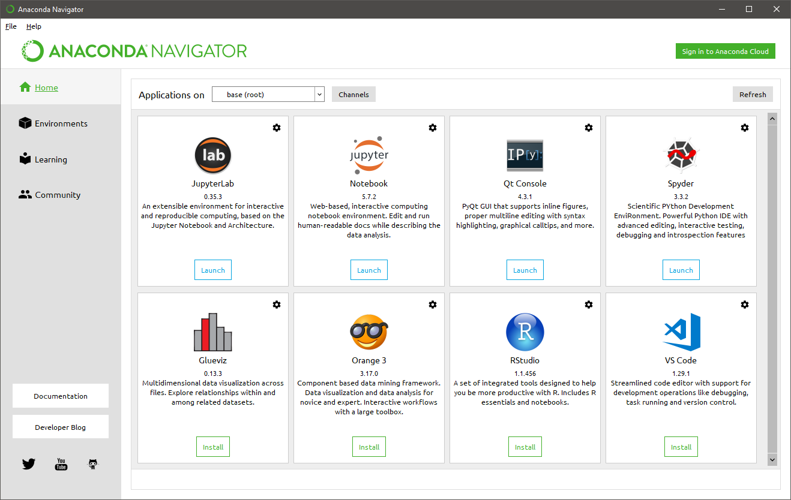
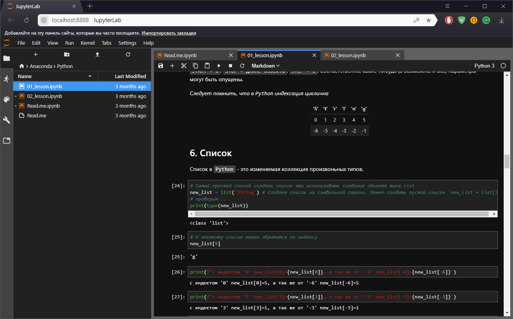
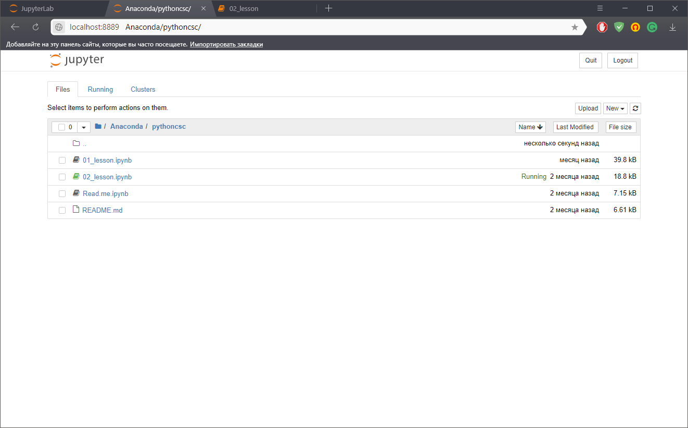
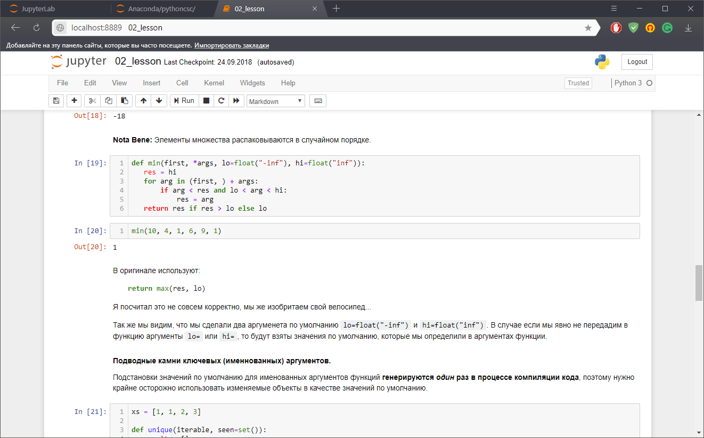
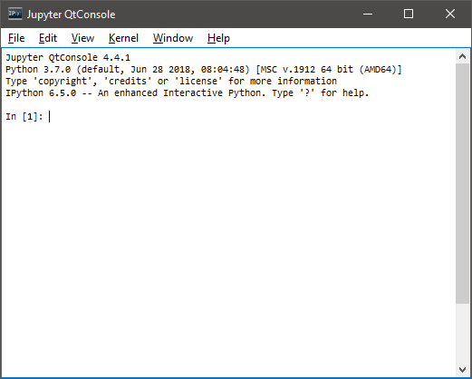
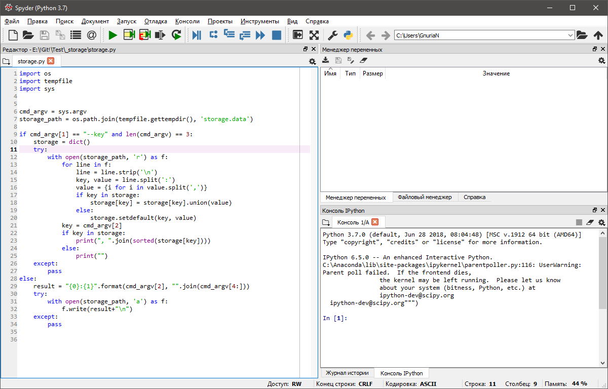

# Anaconda


**Anaconda** - это дистрибутив с установленным в него "большим" набором инструментов для работы с данными. Он основан да систему управления версий [Conda](https://conda.io/docs/). Скачать свежую версию, всегда можно скачать с [https://www.anaconda.com/download](https://www.anaconda.com/download/).

Что входив с состав данного дистрибутива?    
    

## Jupyter Lab
**JupyterLab** – гибкой, интегрируемой и легко расширяемой среды, поддерживающей одновременную работу с несколькими блокнотами Jupyter, текстовыми файлами, датасетами, терминалами и другими компонентами. Аналогично классическим IDE в JupyterLab можно упорядочивать документы в рабочей области в удобном порядке при помощи вкладок и разделителей.    
    

## Notebook
**Jupyter Notebook** – это крайне удобный инструмент для создания красивых аналитических отчетов, так как он позволяет хранить вместе код, изображения, комментарии, формулы и графики:    
    
    

P.S. Есть очень интересная статья, которая посвещена этим двум инструментам: [https://proglib.io/p/jupyter/](https://proglib.io/p/jupyter/)

Существует небольшой "косяк" (_ну это я так щитаю_), по умолчанию эти программы (_в операционной среде Windows_)запускаются с рабочей диреторией `%USERPROFILE%`, и чтобы это исправить, нужно изменить запуск в ярлыках, или запускать программы с указанием директорий.    
Пример:
```console
C:\Anaconda\python.exe C:\Anaconda\cwp.py C:\Anaconda C:\Anaconda\python.exe C:\Anaconda\Scripts\jupyter-lab-script.py %Anaconda%
```
или
```console
C:\Anaconda\python.exe C:\Anaconda\cwp.py C:\Anaconda C:\Anaconda\python.exe C:\Anaconda\Scripts\jupyter-notebook-script.py %Anaconda%
```
где `%Anaconda%` - это переменная окружения. Но вы всегда можете создать и свои `костыли` =)
```console
> echo %Anaconda%
E:\!Git!
```

## Qt Console
**Qt Console** - это GUI для реализации IPython.    
    

## Spyder
**Spyder** - свободная и кроссплатформенная интерактивная IDE для научных расчетов на языке Python, обеспечивающая простоту использования функциональных возможностей и легковесность программной части.    
    

## Glueviz

## Orange 3

## RStudio

## VS code

---

## Полезные статьи связаные с дистрибутивом Anaconda

1. [ ] - [Настраиваем Python для машинного обучения на Windows](https://proglib.io/p/ml-python-setup/). Очень много информации по работе с conda и как управлять пакетами и окружением.
2. [ ] - 
