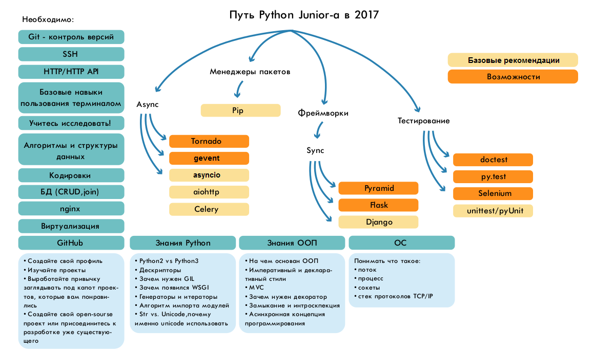

# Python-Roadmap

Дорожная карта по изучению Python

Я решил сделать, пока, для себя что-то вроде дорожной карты (Road map) для изучения языка Python и конечной цели получение работы.  Возможно, если найдутся желающие дополнять ее, модифицировать и редактировать, то получиться хорошая инструкция не только для меня, но и для других. 

**Почему Я решил это сделать?** Просто это не [первая моя попытка](previous-history.md) стать разработчиком программного обеспечения (программистом), но до этого все сводилось к тому, что я просто изучал язык и думал, если я его выучу, то смогу найти работу. Но все оказалось совсем не так. Базовых знаний всегда не хватает, даже, чтобы устроится новичком.

* Нулевая версия:  
   * Текстовая версия: [Roadmap-Python-v.0.md](Roadmap-Python-v.0.md) (Закрыто)
   * Текстовая версия: [Roadmap-Python-v.0.1.md](Roadmap-Python-v.0.1.md) (Текст)
   * Схема [RoadmapPython.gv.pdf](RoadmapPython.gv.pdf)
       * Скрипт [RoadmapPython.py](RoadmapPython.py)
* Необходимые технологии [Technology.md](Technology.md)
* Полезные утилиты [UsefulUtilities.md](UsefulUtilities.md)
* Очень полезная статья про библиотеки/фреймворки и утилиты. Постоянно пополняется и обновляется.  [awesomo/languages/PYTHON](https://github.com/lk-geimfari/awesomo/blob/master/languages/PYTHON.md)
* Ссылки на обучающие [видео](video_lessons.md)

Нашел я тут на просторах забавную картинку:

